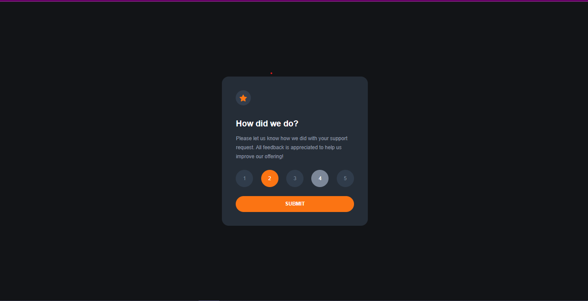

# Frontend Mentor - Interactive rating component solution

- View the optimal layout for the app depending on their device's screen size
- See hover states for all interactive elements on the page
- Select and submit a number rating
- See the "Thank you" card state after submitting a rating

### Screenshot




### Links

- Solution URL: [Solution URL](https://github.com/Jemi-code/InteractiveRating)
- Live Site URL: [Live site](https://jemi-code.github.io/InteractiveRating)

## My process

### Built with

- Semantic HTML5 markup
- CSS custom properties
- Flexbox
- Mobile-first workflow

### What I learned
```js
let options = (value) => {
    sessionStorage.setItem("rating", " "+value);
    console.log(" "+value);
}

let storage = sessionStorage.getItem("rating");
console.log(storage);
selected.innerHTML = storage;
```

- Frontend Mentor - [@Jemi-code](https://www.frontendmentor.io/profile/Jemi-code)